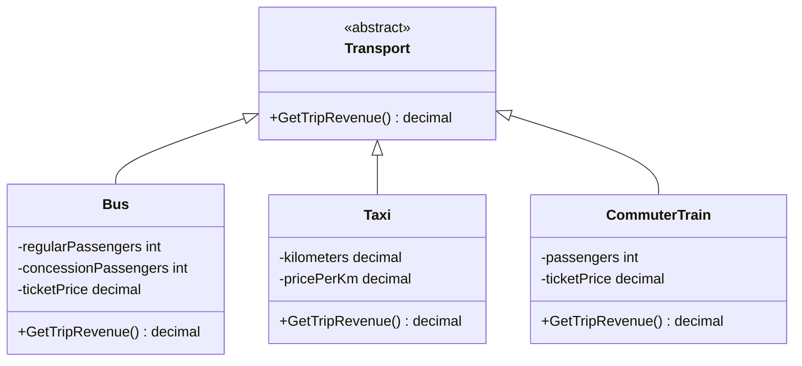
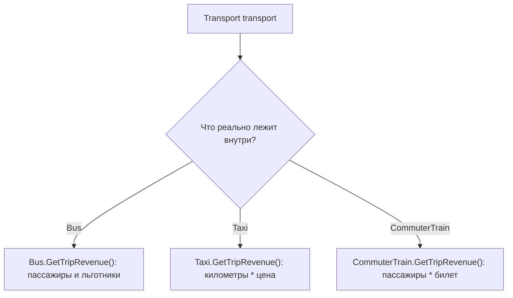
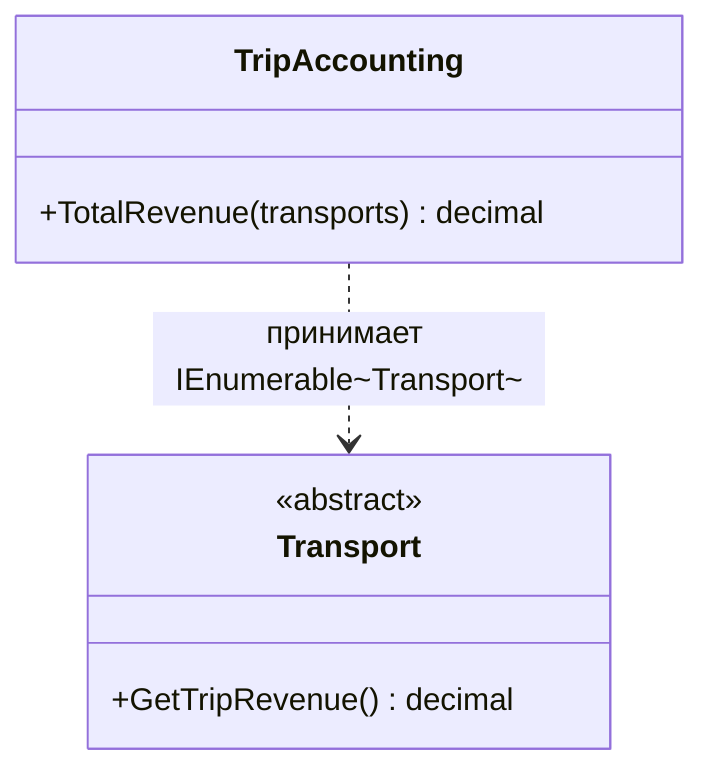
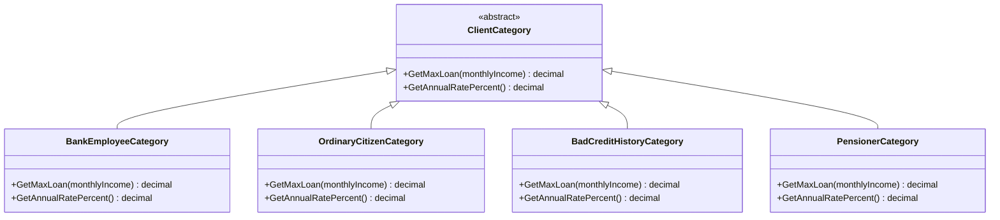
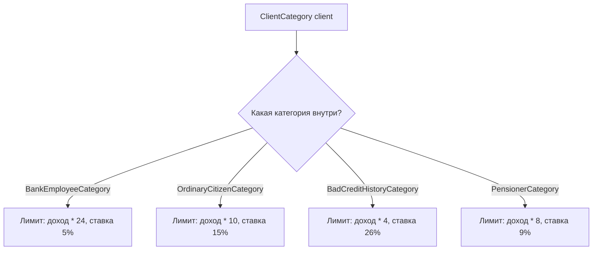
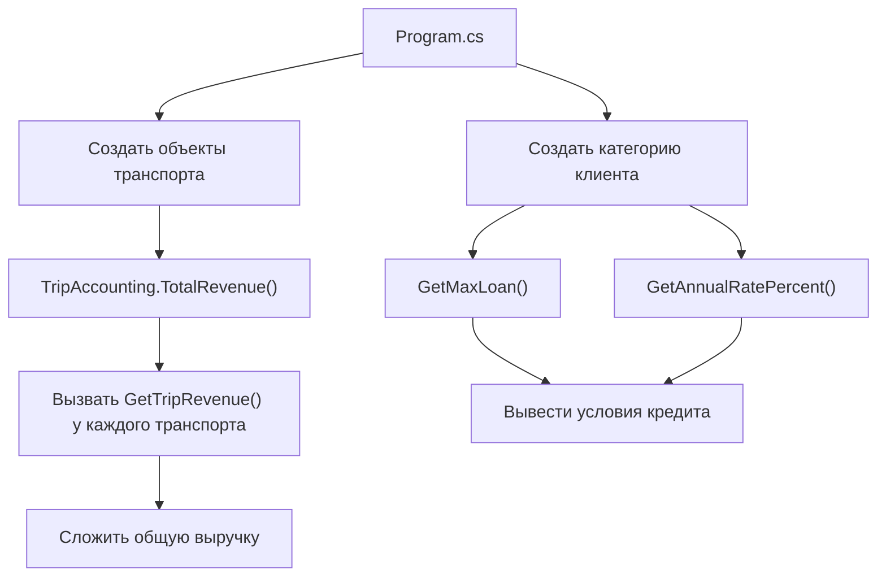

# ООП. Лабораторная работа 3

## Постановка задачи

В работе нужно было выполнить 2 задачи.

1. Создать программу для расчета общей выручки за рейс в предметной области "Пассажирский транспорт". Должны быть разные виды транспорта: автобус, такси, электричка. Для каждого транспорта выручка считается по-своему.
2. Создать программу для расчета возможного размера кредита и процентной ставки для разных категорий клиентов банка: сотрудник банка, обычный гражданин, клиент с плохой кредитной историей, пенсионер.

Также по каждой задаче нужно было написать unit-тесты.

## Какая теория отрабатывается

Главная тема работы - полиморфизм.

Простыми словами: в программе есть общий базовый тип, но разные наследники выполняют один и тот же метод по-разному.

В работе используются:

- абстрактные классы;
- наследование;
- переопределение методов через `override`;
- работа с коллекцией объектов базового типа;
- unit-тестирование через NUnit.

## Как реализовано

Работа находится в папке `ООП/lab_3`.

Создано 8 основных файлов, если не считать служебные папки `bin` и `obj`.

### Файлы проекта

- `Lab3.sln` - файл решения Visual Studio.
- `Lab3/Lab3.csproj` - проект консольного приложения.
- `Lab3.Tests/Lab3.Tests.csproj` - проект с NUnit-тестами.

### Основная программа

- `Lab3/TransportDomain.cs` - описывает транспорт.

В нем есть абстрактный класс `Transport` с методом `GetTripRevenue()`.

От него наследуются:

- `Bus` - автобус. Выручка считается по количеству обычных и льготных пассажиров. Льготный билет стоит половину обычного.
- `Taxi` - такси. Выручка считается как километры умножить на цену за километр.
- `CommuterTrain` - электричка. Выручка считается как количество пассажиров умножить на цену билета.

Также есть класс `TripAccounting`, который принимает список транспорта и суммирует выручку всех объектов.

- `Lab3/CreditDomain.cs` - описывает категории клиентов банка.

В нем есть абстрактный класс `ClientCategory` с методами:

- `GetMaxLoan()` - максимальная сумма кредита;
- `GetAnnualRatePercent()` - годовая процентная ставка.

Наследники:

- `BankEmployeeCategory` - сотрудник банка, самый высокий лимит и низкая ставка;
- `OrdinaryCitizenCategory` - обычный гражданин;
- `BadCreditHistoryCategory` - клиент с плохой кредитной историей, низкий лимит и высокая ставка;
- `PensionerCategory` - пенсионер, льготная ставка.

- `Lab3/Program.cs` - демонстрация работы программы.

В нем создаются разные виды транспорта, считается общая выручка, затем создается клиент банка и выводится его кредитный лимит и ставка.

## Схемы и зависимости

### Наследование в задаче про транспорт



Смысл схемы: `Bus`, `Taxi` и `CommuterTrain` наследуются от `Transport`. У всех есть общий метод `GetTripRevenue()`, но формула расчета разная.

Здесь и находится полиморфизм: переменная может иметь тип `Transport`, но внутри реально лежит `Bus`, `Taxi` или `CommuterTrain`. При вызове `GetTripRevenue()` выполнится метод конкретного класса.



Пример полиморфизма в коде:

```csharp
Transport transport = new Taxi(12m, 35m);
decimal revenue = transport.GetTripRevenue();
```

Тип переменной - `Transport`, но вызывается реализация из `Taxi`.

### Зависимость вспомогательного класса

`TripAccounting` не наследуется от `Transport`. Он только использует коллекцию объектов типа `Transport`, чтобы сложить их выручку. То есть это не часть иерархии наследования, а отдельный вспомогательный класс.



Если убрать `TripAccounting`, идея полиморфизма не пропадет. Общую сумму можно было бы посчитать прямо в `Program.cs`:

```csharp
decimal total = 0m;

foreach (Transport transport in transports)
{
    total = total + transport.GetTripRevenue();
}
```

`TripAccounting` просто выносит этот расчет в отдельное место.

### Наследование в задаче про кредиты



Смысл схемы: все категории клиентов имеют одинаковый набор методов, но каждая категория возвращает свой кредитный лимит и свою ставку.

Здесь полиморфизм такой же: переменная может быть типа `ClientCategory`, но объект внутри может быть любой конкретной категорией клиента.



Пример:

```csharp
ClientCategory client = new PensionerCategory();
decimal loan = client.GetMaxLoan(30000m);
decimal rate = client.GetAnnualRatePercent();
```

Тип переменной - `ClientCategory`, но методы выполняются из `PensionerCategory`.

### Общий ход программы



Эта схема показывает, что `Program.cs` не знает подробности формул. Он просто вызывает общие методы, а конкретный класс сам решает, как считать.

### Тесты

- `Lab3.Tests/TransportTests.cs` - 10 тестов для транспорта.

Проверяется расчет выручки автобуса, такси, электрички, суммирование выручки и работа через базовый тип `Transport`.

- `Lab3.Tests/CreditTests.cs` - 10 тестов для кредитов.

Проверяются лимиты и ставки для разных категорий клиентов, а также то, что полиморфизм работает через базовый тип `ClientCategory`.

## Короткий вывод

В этой лабораторной показано, что разные классы могут иметь общий интерфейс поведения, но разную реализацию. Транспорт считает выручку по-разному, категории клиентов считают кредитные условия по-разному, но вызываются через общие методы.
