# ООП. Лабораторная работа 4

## Постановка задачи

В работе нужно было выполнить 10 небольших задач на массивы, коллекции и словари.

Кратко:

1. Объединить массив фамилий и массив имен в один массив.
2. Отсортировать массив фамилий пузырьком.
3. Смоделировать очередь студентов на отчисление через `Queue`.
4. Создать англо-русский словарь.
5. Переделать очередь студентов через массив и индексатор.
6. Разбить общий массив имен и фамилий на два отдельных массива.
7. Отсортировать массив имен сортировкой вставками.
8. Смоделировать стек мыслей через `Stack`.
9. Создать русско-английский словарь.
10. Переделать стек мыслей через массив и индексатор.

Для задач с очередью и стеком нужно было написать unit-тесты.

## Какая теория отрабатывается

В работе отрабатываются:

- массивы;
- алгоритмы сортировки;
- коллекции `Queue` и `Stack`;
- словари `Dictionary`;
- интерфейсы;
- классы-обертки;
- индексаторы;
- простая логика принятия решения;
- unit-тестирование.

## Как реализовано

Работа находится в папке `ООП/Lab_4`.

Создано 28 основных файлов, если не считать служебные папки `bin` и `obj`.

### Файлы проекта

- `Lab4.sln` - файл решения Visual Studio.
- Для каждой задачи создан отдельный консольный проект `Task1` ... `Task10`.
- `Lab4.Tests/Lab4.Tests.csproj` - проект с NUnit-тестами.

## Общая схема работы

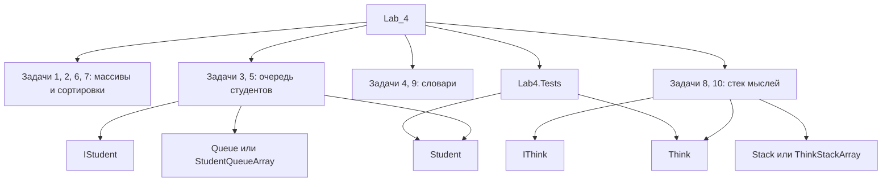

Схема показывает, что работа разделена на независимые маленькие проекты. Общие полноценные классы есть в задачах про очередь студентов и стек мыслей, поэтому тесты проверяют именно их.

## Наследование, интерфейсы и полиморфизм

В 4-й работе обычного наследования классов почти нет. Вместо него используются интерфейсы. Это тоже важная часть ООП: класс не наследует готовую реализацию, а обещает, что у него будут нужные методы.

### Задача 3. Студент и интерфейс

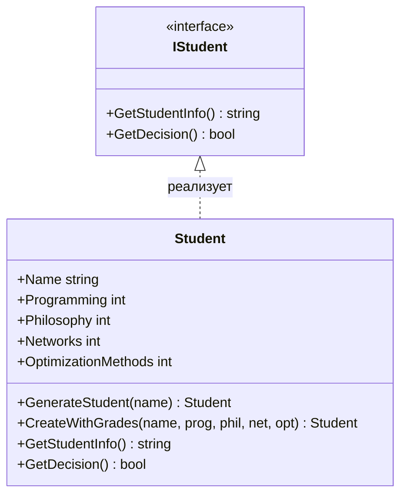

Здесь `Student` не наследуется от класса, а реализует интерфейс `IStudent`. Это значит, что объект `Student` обязан иметь методы `GetStudentInfo()` и `GetDecision()`.

Полиморфизм через интерфейс выглядел бы так:

```csharp
IStudent student = Student.CreateWithGrades("Иванов", 2, 2, 4, 5);
bool expelled = student.GetDecision();
```

Тип переменной - `IStudent`, но метод выполняется из класса `Student`.

### Задача 8. Мысль и интерфейс

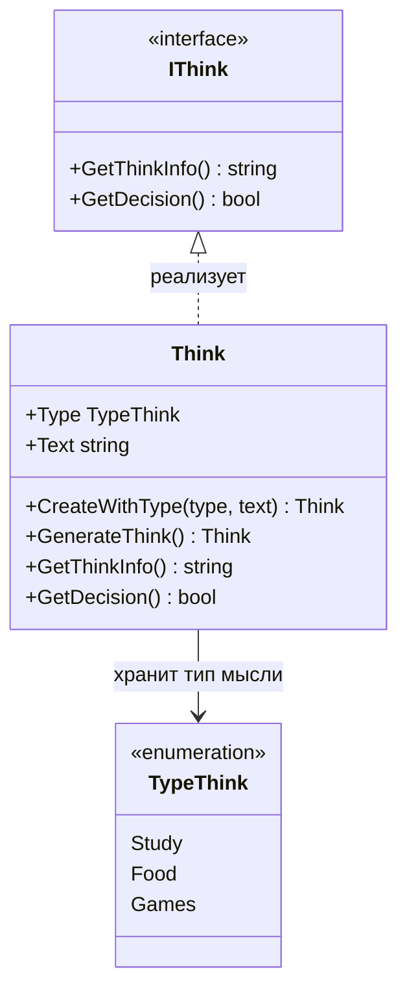

Здесь `Think` реализует интерфейс `IThink`. Метод `GetDecision()` решает, хорошая мысль или плохая.

Полиморфизм через интерфейс:

```csharp
IThink think = Think.CreateWithType(TypeThink.Study, "Надо сделать лабу");
bool good = think.GetDecision();
```

Тип переменной - `IThink`, но вызывается реализация из `Think`.

### Связь классов-оберток с основными классами

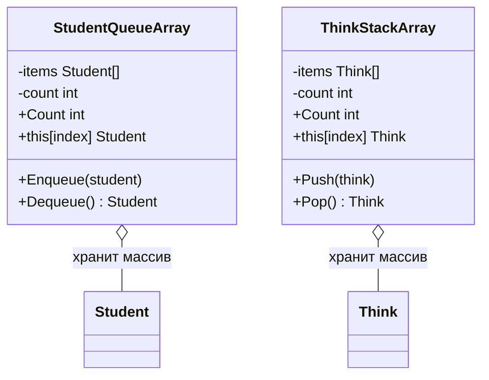

`StudentQueueArray` и `ThinkStackArray` ни от кого не наследуются. Они просто хранят массив объектов и дают удобные методы для работы с ним.

### Где здесь ООП

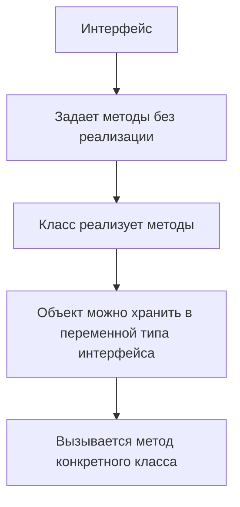

Главная ООП-идея в этой работе: программа может работать не только с конкретным классом, но и с интерфейсом. Это похоже на наследование по смыслу использования, но технически это реализация интерфейса.

## Что написано по задачам

### Задача 1. Объединение массивов

Файл: `Task1_MergeArrays/Program.cs`.

Созданы два массива: фамилии и имена. Затем создается общий массив, где по четным индексам стоят имена, а по нечетным - фамилии.

### Задача 2. Сортировка пузырьком

Файл: `Task2_BubbleSort/Program.cs`.

Создан массив фамилий. Сортировка выполняется вложенными циклами: соседние элементы сравниваются и меняются местами, если стоят в неправильном порядке.

### Задача 3. Очередь студентов

Файлы:

- `Task3_Queue/Program.cs`;
- `Task3_Queue/Student.cs`.

В `Student.cs` создан интерфейс `IStudent` с методами:

- `GetStudentInfo()`;
- `GetDecision()`.

Класс `Student` хранит имя и оценки по предметам. Метод `GenerateStudent()` создает случайного студента. Метод `GetDecision()` решает, отчислять студента или нет. Логика такая: если у студента две или больше двоек, он отчисляется.

В `Program.cs` создается `Queue<Student>`, студенты добавляются в очередь, затем извлекаются из нее по правилу FIFO: кто первым добавлен, тот первым обработан.

Схема зависимостей:

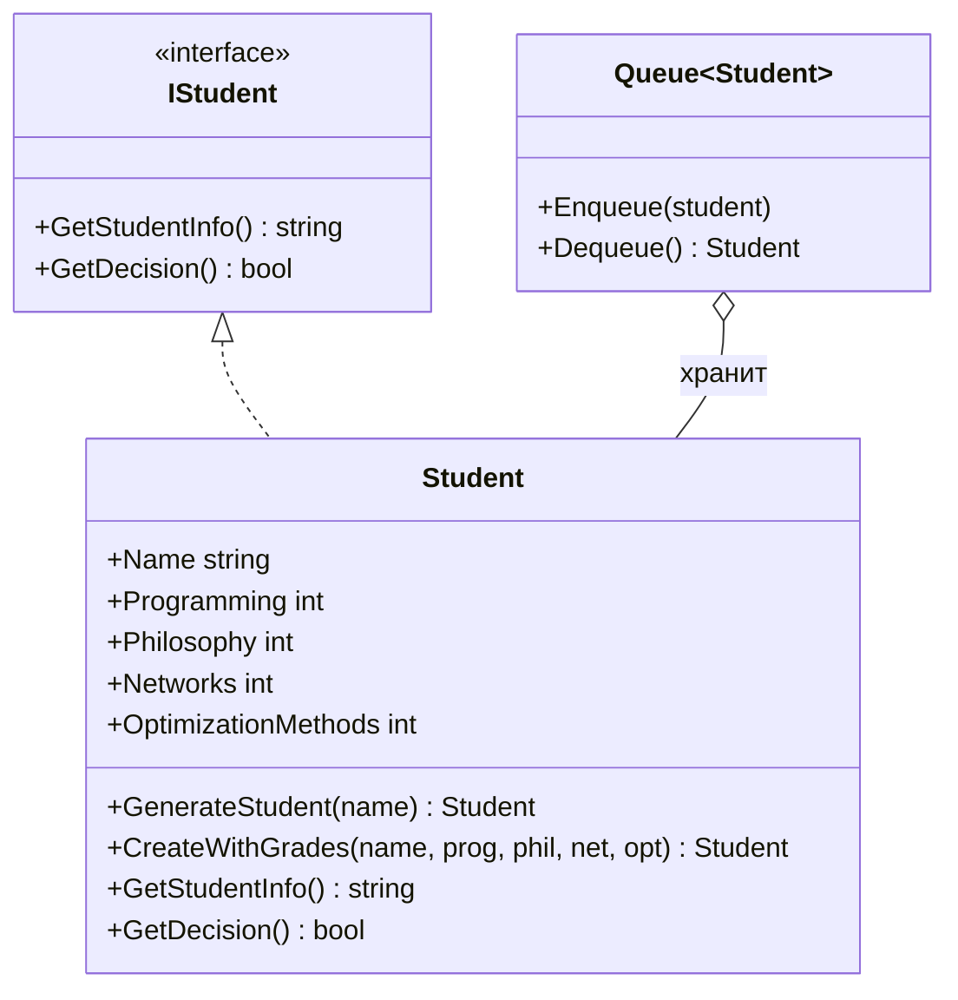

Схема логики отчисления:

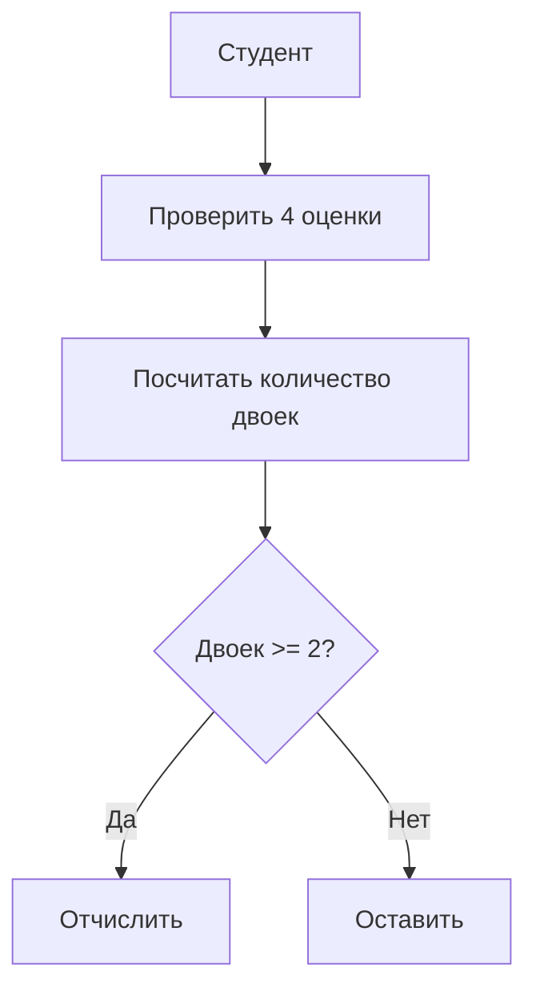

### Задача 4. Англо-русский словарь

Файл: `Task4_EnRuDict/Program.cs`.

Создан `Dictionary<string, string>`, где ключ - английское слово, значение - русский перевод. Пользователь вводит слово, программа ищет перевод через `TryGetValue()`.

### Задача 5. Очередь через массив и индексатор

Файлы:

- `Task5_QueueWithIndexer/Program.cs`;
- `Task5_QueueWithIndexer/StudentQueueArray.cs`.

Вместо стандартного `Queue` создан класс-обертка `StudentQueueArray`. Внутри хранится массив студентов. Есть методы:

- `Enqueue()` - добавить студента;
- `Dequeue()` - достать первого студента;
- индексатор `this[int index]` - получить студента по индексу.

Если массив заполняется, он расширяется через `Array.Resize()`.

Схема обертки над массивом:

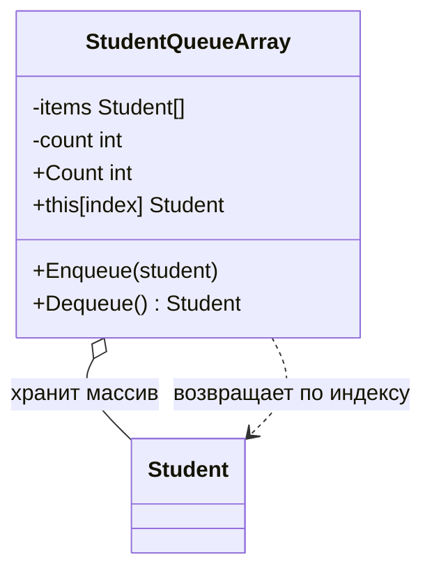

### Задача 6. Разделение массива

Файл: `Task6_SplitArray/Program.cs`.

Есть общий массив вида: имя, фамилия, имя, фамилия. Программа проходит по массиву и раскладывает значения в два отдельных массива: имена и фамилии.

### Задача 7. Сортировка вставками

Файл: `Task7_InsertionSort/Program.cs`.

Создан массив имен. Сортировка вставками берет очередной элемент и вставляет его в правильное место среди уже отсортированных элементов слева.

### Задача 8. Стек мыслей

Файлы:

- `Task8_Stack/Program.cs`;
- `Task8_Stack/Think.cs`.

В `Think.cs` создан enum `TypeThink` с типами мыслей:

- `Study`;
- `Food`;
- `Games`.

Есть интерфейс `IThink` с методами:

- `GetThinkInfo()`;
- `GetDecision()`.

Класс `Think` хранит тип и текст мысли. Метод `GenerateThink()` создает случайную мысль. Метод `GetDecision()` считает мысль хорошей, если она про учебу.

В `Program.cs` используется `Stack<Think>`. Мысли добавляются в стек и выводятся по правилу LIFO: последняя добавленная мысль обрабатывается первой.

Схема зависимостей:

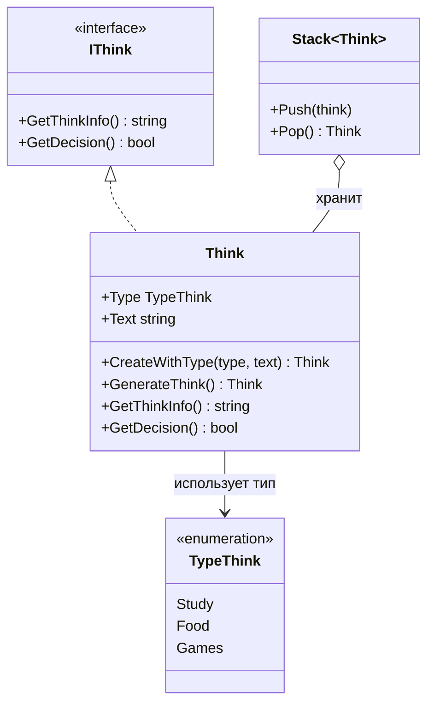

Схема логики мысли:

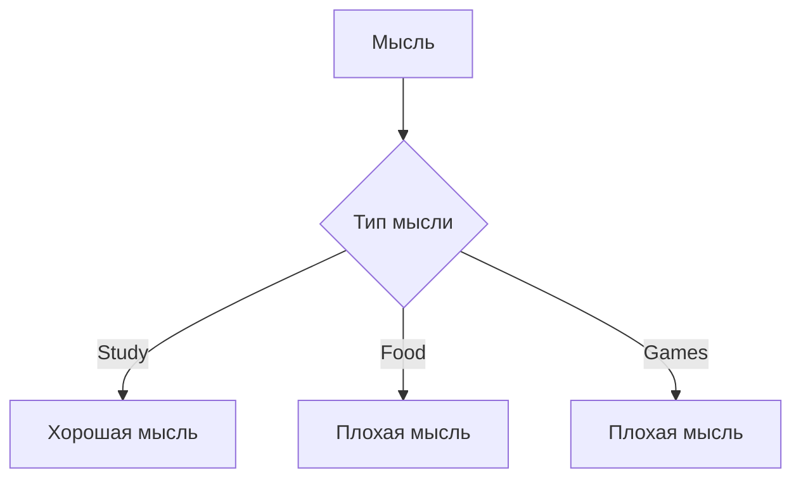

### Задача 9. Русско-английский словарь

Файл: `Task9_RuEnDict/Program.cs`.

Создан `Dictionary<string, string>`, где ключ - русское слово, значение - английский перевод. По введенному слову программа ищет перевод.

### Задача 10. Стек через массив и индексатор

Файлы:

- `Task10_StackWithIndexer/Program.cs`;
- `Task10_StackWithIndexer/ThinkStackArray.cs`.

Создан класс-обертка `ThinkStackArray`. Внутри используется массив мыслей. Есть методы:

- `Push()` - добавить мысль;
- `Pop()` - достать последнюю добавленную мысль;
- индексатор `this[int index]` - получить мысль по индексу.

Схема обертки над массивом:

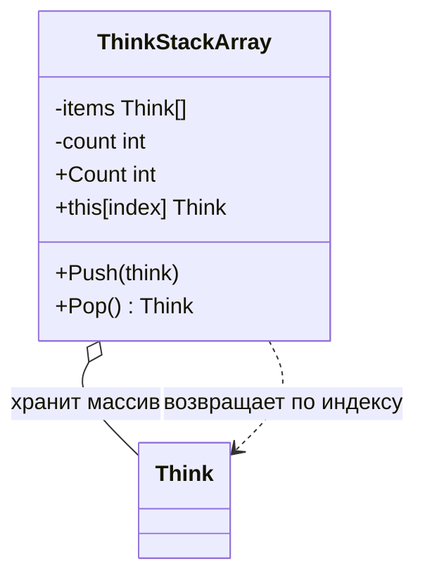

### Схема коллекций FIFO и LIFO

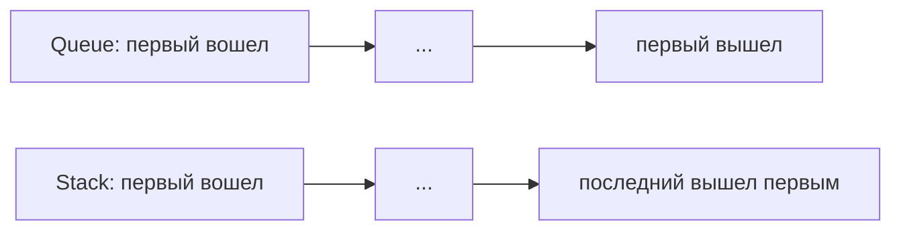

## Тесты

Файлы:

- `Lab4.Tests/QueueTests.cs`;
- `Lab4.Tests/StackTests.cs`.

В `QueueTests.cs` проверяется логика отчисления студента: две двойки или больше - отчислить, одна двойка или ни одной - оставить.

В `StackTests.cs` проверяется логика мыслей: мысли об учебе считаются хорошими, мысли о еде и играх - плохими. Также проверяется, что информация о мысли содержит тип и текст.

## Короткий вывод

В этой лабораторной показана базовая работа с коллекциями и структурами данных. Массивы используются для хранения данных, сортировки показывают простые алгоритмы, словари дают быстрый поиск по ключу, а `Queue` и `Stack` демонстрируют разные порядки обработки элементов.
