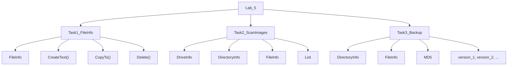
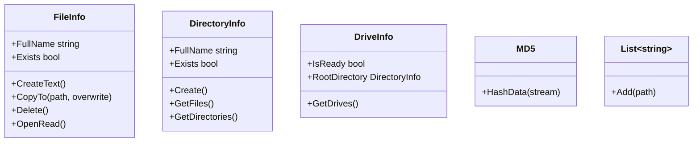
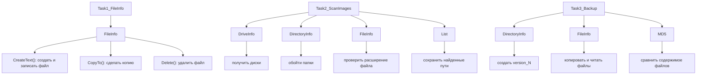
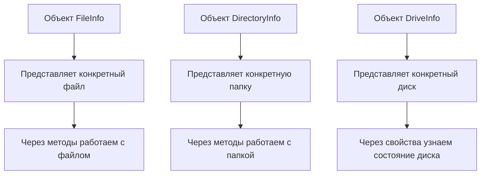
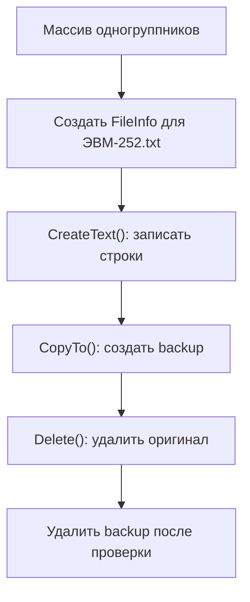
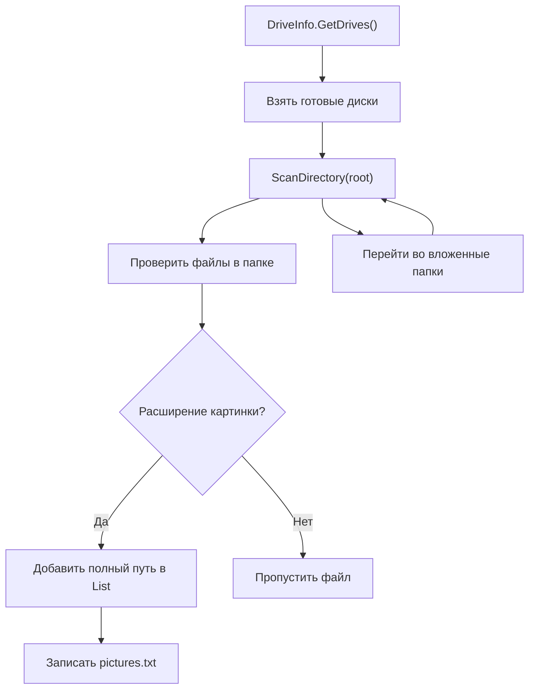
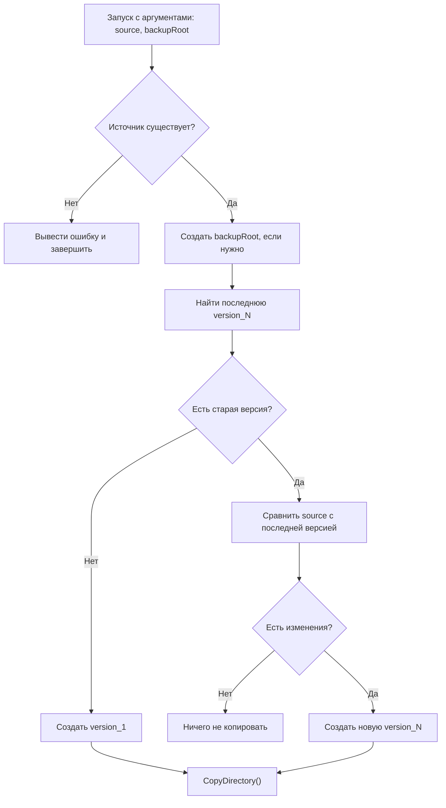
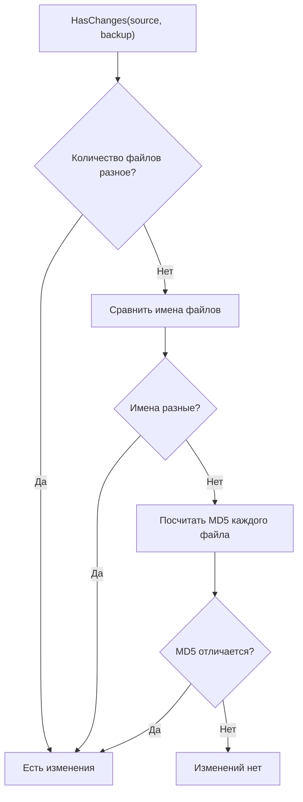

# ООП. Лабораторная работа 5

## Постановка задачи

Выполнен вариант 2: работа с классом `FileInfo`.

Нужно было выполнить 3 задачи.

1. Создать текстовый файл с названием группы, записать туда имена и фамилии одногруппников, сделать резервную копию файла и удалить оригинал.
2. Обойти диски и папки, найти изображения, сохранить полные пути к ним в список и записать список в файл.
3. Написать программу резервного копирования папки с версиями. Если изменений нет, новая копия не создается.

## Какая теория отрабатывается

В работе отрабатываются:

- работа с файлами через `FileInfo`;
- работа с папками через `DirectoryInfo`;
- обход дисков через `DriveInfo`;
- чтение и запись текстовых файлов;
- копирование и удаление файлов;
- рекурсивный обход папок;
- обработка ошибок доступа;
- расчет MD5-хеша файла;
- простое версионирование резервных копий.

## Как реализовано

Работа находится в папке `ООП/Lab_5`.

Создано 7 основных файлов, если не считать служебные папки `bin` и `obj`.

### Файлы проекта

- `Lab5.sln` - файл решения Visual Studio.
- `Task1_FileInfo/Task1_FileInfo.csproj` - проект первой задачи.
- `Task2_ScanImages/Task2_ScanImages.csproj` - проект второй задачи.
- `Task3_Backup/Task3_Backup.csproj` - проект третьей задачи.

## Общая схема зависимостей



Схема показывает, что все задачи работают с файловой системой, но используют ее по-разному: первая с одним файлом, вторая с поиском по дискам, третья с резервными копиями папок.

## Наследование и зависимости

В 5-й работе своих классов-наследников нет. Это не лабораторная на наследование, а лабораторная на работу с файловой системой.

Главная идея здесь - не "кто от кого наследуется", а "какой системный класс за что отвечает".

### Какие классы используются



Это не схема наследования, а схема используемых классов и методов. Все эти классы уже есть в .NET, работа просто применяет их.

### Связь задач с классами .NET



### Где здесь ООП



ООП здесь проявляется в том, что файл, папка и диск представлены объектами. У каждого объекта есть свои свойства и методы.

### Полиморфизм в этой работе

Своего полиморфизма, как в 3-й работе, здесь почти нет. Метод `CopyDirectory()` работает с `DirectoryInfo`, `GetMd5()` работает с `FileInfo`, но классы-наследники не создаются.

Для защиты можно сказать так:

> В 5-й лабораторной основной акцент не на наследовании, а на использовании готовых классов .NET для работы с файловой системой. Здесь важны объекты `FileInfo`, `DirectoryInfo`, `DriveInfo` и их методы.

## Что написано по задачам

### Задача 1. Файл группы и резервная копия

Файл: `Task1_FileInfo/Program.cs`.

В программе создан массив одногруппников. Затем:

1. Создается файл `ЭВМ-252.txt`.
2. В файл записываются имена и фамилии.
3. Через `FileInfo.CopyTo()` создается резервная копия `ЭВМ-252_backup.txt`.
4. Оригинальный файл удаляется через `FileInfo.Delete()`.
5. В конце резервная копия тоже удаляется, чтобы программа не оставляла мусор после запуска.

Схема выполнения:



### Задача 2. Поиск изображений на дисках

Файл: `Task2_ScanImages/Program.cs`.

Программа:

1. Получает все готовые к работе диски через `DriveInfo.GetDrives()`.
2. Для каждого диска запускает рекурсивный обход папок.
3. Проверяет расширения файлов: `.jpg`, `.jpeg`, `.png`, `.bmp`, `.gif`, `.tiff`, `.webp`.
4. Полные пути найденных изображений добавляет в `List<string>`.
5. Записывает список путей в файл `pictures.txt`.

Если к папке нет доступа, ошибка перехватывается, и программа продолжает обход дальше.

Схема рекурсивного обхода:



### Задача 3. Резервное копирование папки

Файл: `Task3_Backup/Program.cs`.

Программа запускается с двумя аргументами:

```text
Task3_Backup <источник> <папка_резервных_копий>
```

Логика работы:

1. Проверяется, существует ли папка-источник.
2. Создается папка для резервных копий, если ее еще нет.
3. Программа ищет уже существующие версии вида `version_1`, `version_2` и так далее.
4. Если копий еще не было, создается `version_1`.
5. Если копии уже были, программа сравнивает источник с последней версией.
6. Сравнение идет по количеству файлов, именам файлов и MD5-суммам.
7. Если изменения есть, создается новая папка версии и туда копируется содержимое.
8. Если изменений нет, программа выводит сообщение и ничего не копирует.

Для копирования используется рекурсивный метод `CopyDirectory()`: он копирует файлы текущей папки и затем повторяет то же самое для вложенных папок.

Схема принятия решения о новой версии:



Схема сравнения папок:



## Короткий вывод

В этой лабораторной показана работа с файловой системой. Первая задача учит создавать, копировать и удалять файлы. Вторая - обходить диски и искать файлы нужного типа. Третья - делать резервные копии с проверкой изменений через MD5.
